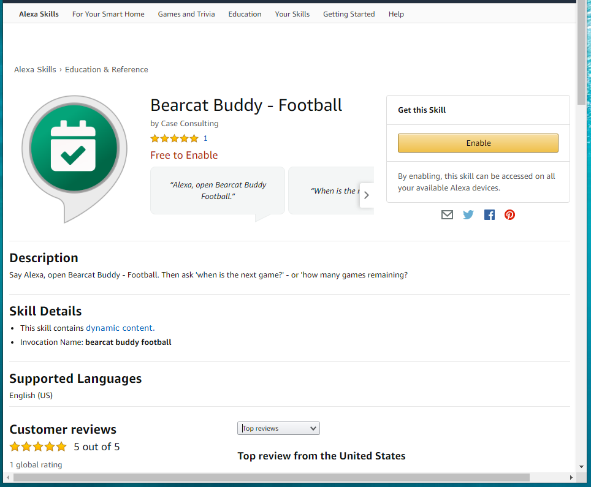

# Workshop 01 - Introduction & Overview (10 minutes)

> Conversational AI is a great way to teach computer science basics. 

## What is Conversational AI?

There are many definitions, but a nice, concise version is:

*Conversational AI is the set of technologies behind automated messaging and speech-enabled applications that offer human-like interactions between computers and humans.*[1]

## Conversational AI with Alexa

Amazon Alexa, Apple Siri, Google Home, Windows Cortana are examples. In this session, we'll be using Amazon Alexa, but common principles apply. 

We'll demo a university sports app and help you build a similar app for your school. 
After the workeshop, you'll be able to create - and engage your students - by making custom skills that can be published an enabled for free. 

First, we'll show how the "Bearcat Buddy Football" skill was created, and why it was needed.  
We'll show all aspects required to design, build and publish your own custom skills.  
Bearcat Buddy Football helps find out when and where our Northwest Missouri State University football games will be. 

If you have an Alexa device:

- You can enable the skill from the store at <https://www.amazon.com/dp/B07SCSD3DV>
- Try it by saying "Alexa, open Bearcat Buddy Football". 

Similar skills could be used to provide assistance with:

- Conference schedules
- Finals schedules
- Other sports teams (Bearcat Buddy - Men's Basketball, Bearcat Buddy - Women's Basketball)
- Any series of upcoming events

We'll work through this example first and then, help you build your own favorite sports team schedule skill. 

## Key Ideas / Vocabulary

- One "Skill" - your app name (unique amoung all skills), e.g., "Bearcat Buddy Football"
- Each skill can have many "Intents" - things your user wants to do "Next Game", "Number Remaining"

## Development Process

1. **Plan** our custom Alexa Skill
2. **Build** - Configue the Skill & Interaction (intents)
3. **Code** - the "behind the scenes" logic (intent handlers)
4. **Test** - try it out
5. Optional: Certify and Deploy - publish your custom skill

## Environment

[Alexa Skills Kit Developer Console](https://developer.amazon.com/alexa/console/ask)
- Configure our custom skill
- Add the serverless functions to handle requests

---

## References

1. https://www.interactions.com/conversational-ai/

## Learn More

- About the [Alexa Skills Kit](https://developer.amazon.com/en-US/alexa/alexa-skills-kit) (used to develop skills)
- About the new [Alexa Conversations](https://build.amazonalexadev.com/Alexa-Conversations-Registration-Page.html) (AI to help you create AI)

---

[ Home :rewind:](./README.md) • [Next :arrow_forward:](./workshop-02.md)

---

