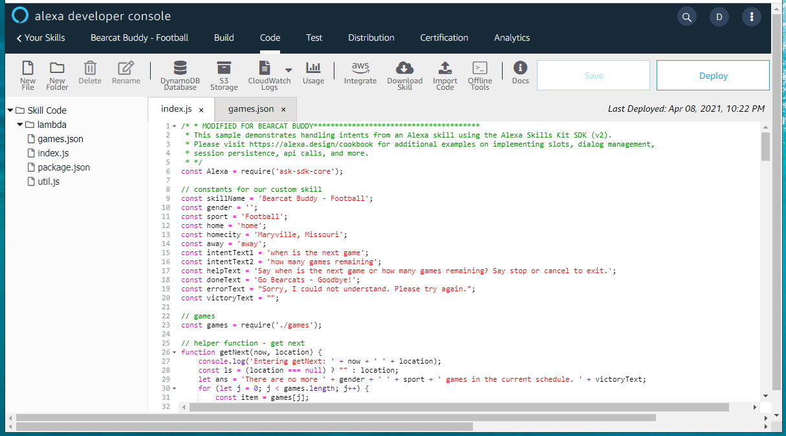

# Workshop 03 - Introducing AWS and Hosting Functions (20 minutes)

   - Amazon Web Services Account
   - Lambda Serverless Functions
   - Skill Code 
   - Editing / Updating Function Code

---

## Amazon Web Services Account

Recently integrated into the Alexa Developer Console for easier access - just accept the prompt to begin creating your functions here.

## Lambda Serverless Functions

Don't need to understand much about 'serverless' functions - they are just what the name implies. 
Allows us to build and host functions easily - we don't care what OS or Server. 
Our examples are in Node (server-side JavaScript), but when building additional functions, you can choose Python as well. 
If you build and host endpoints elsewhere, additional langages like Go are available as well. 

## Skill Code

- package.json - provided / not editiable
- util.js - provided / not editable
- index.js - a default is provided - we will modify and extend this
- games.json - we add a "New File" to hold the game information. 

As you follow this example, the only thing you will need to update is the game data. 
No need to write custom code. 
Just create a custom invokation for your favorite sports team and update the information in the games file. 

### index.js

1. Require the sdk (at the top)
2. Configure your constants (second section)
3. Require the games.json data file (~22-23)
4. Copy the helper function to "get next" 
5. Copy the helper function to "get remaining" 

Handlers

Each handler takes in a "HandlerInput" object, providdes a custom ResponseBuilder that can speak and listen for more

1. Launch Request Handler (on start)
2. Next Intent Handler - the first of our custom Intent Handlers
3. Remaining Intent Handler - the second of our custom Intent Handlers
4. Help Intent Handler 
5. Cancel And Stop Intent Handler 
6. Fallback Intent Handler
7. Session Ended Request Handler (on end)
8. Intent Reflector Handler - for debugging
9. ErrorHandler - say what? 

Constructor

1. Include new custom handlers
2. Remove unneeded handlers (e.g. HelloWorldIntentHandler)

```Node
**
 * This handler acts as the entry point for your skill, routing all request and response
 * payloads to the handlers above. Make sure any new handlers or interceptors you've
 * defined are included below. The order matters - they're processed top to bottom 
 * */
exports.handler = Alexa.SkillBuilders.custom()
    .addRequestHandlers(
        LaunchRequestHandler,
        NextIntentHandler,  //  add custom intents and remove any unnecessary ones (e.g. hello world)
        RemainingIntentHandler, //  add custom intents and remove any unnecessary ones (e.g. hello world)
         // HelloWorldIntentHandler,
        HelpIntentHandler,
        CancelAndStopIntentHandler,
        FallbackIntentHandler,
        SessionEndedRequestHandler,
        IntentReflectorHandler, // make sure IntentReflectorHandler is last so it doesn't override your custom intent handlers
    )
    .addErrorHandlers(
        ErrorHandler,
    )
    .lambda();
```

## Editing / Updating

- Click "Save"
- Click "Deploy to live"

Test by going back and forth between "Code" and "Test" tabs.

- Error messages are marked with red x. Messages are typically helpful. 
- Warnings are marked with yellow. Good static analysis tools - e.g., found == - don't you want === which is an excellent JavaScript suggestion.

Downloading Code

- You can download an online copy of your code (see archives folder).
- All this work was done entirely in the browser - local execution is not needed (and may not work correctly).

---

[:arrow_backward: Back ](./workshop-02.md) • [Next :arrow_forward:](./workshop-04.md)

---


