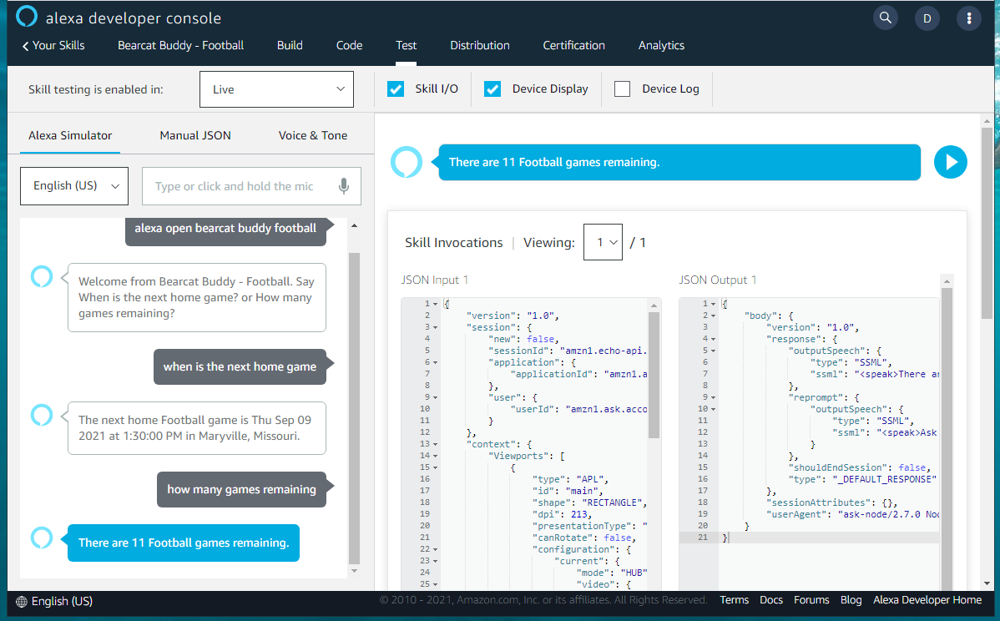

# Workshop 04 - Demonstrating Testing & Submission Process (10 minutes)

- Testing
- Invoke 
- Issue Utterances (associated with your custom intents)
- Close

## Testing

Now we get to play with our Alexa Device. 

(Real devices are frequently used at home, and are connected to our personal account.)

The "Test" tab allows us to try out our new custom skill. 

## Invoke Your Custom Skill

Invoke the custom skill with your invokation. For example:

```
alexa, open Bearcat Buddy Football
```

Try any of the utterances that invoke the first intent. For example:

```
when is the next home game
```

Try any of the utterances that invoke the second intent. For example:

```
how many games remaining
```

Close the skill. For example, say "Close" or "Stop", or our custom utterance:

```
that's all
```

Once we build, code, and test, we're ready to publish to the store. 
We'll need to add some icons and configure our store advertisement. That's next.


---

[:arrow_backward: Back ](./workshop-03.md) • [ Next :arrow_forward:](./workshop-05.md)

---


