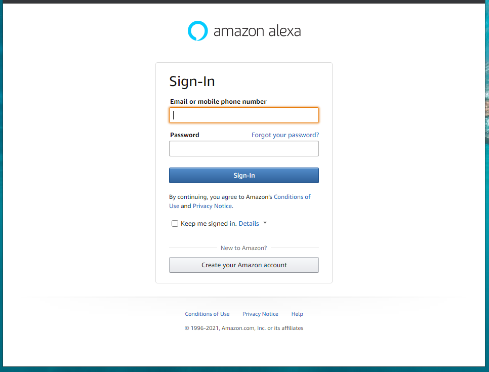

# Workshop 05 - Creating Alexa and AWS Accounts/Break (30 minutes) 

> Get started with AWS and Alexa. 

## Recommendation - Same email

Use the same email for your Amazon / AWS account as you use for your Alexa Dev Portal 
(and if you have an Amazon device, the same email associated with your Alexa/Dot.
Then, you can access your custom skill on your device without having to publish via the Alexa store.

## Need an Alexa Account?

If you don't have an Alexa Developer account:

1. Go to [Alexa Skills Kit](https://developer.amazon.com/en-US/alexa/alexa-skills-kit/)
2. Click "Console"
3. Click "Create your Amazon Account"

## Already Have an Amazon Account?

If you already have an Amazon account, you can use that account. 

## Need an Amazon Account?

If you don't have an Amazon account:

1. Follow the prompts. 
2. More help is available at [How do I create and activate a new AWS account?](https://aws.amazon.com/premiumsupport/knowledge-center/create-and-activate-aws-account/)
3. You might need a credit card to get started (even though this workshop should not incur any charges). 

## Links

- [AWS](https://aws.amazon.com/)
- [Alexa Dev](https://developer.amazon.com/alexa/console/ask)

---

[:arrow_backward: Back ](./workshop-04.md) • [ Next :arrow_forward:](./workshop-06.md)

---

