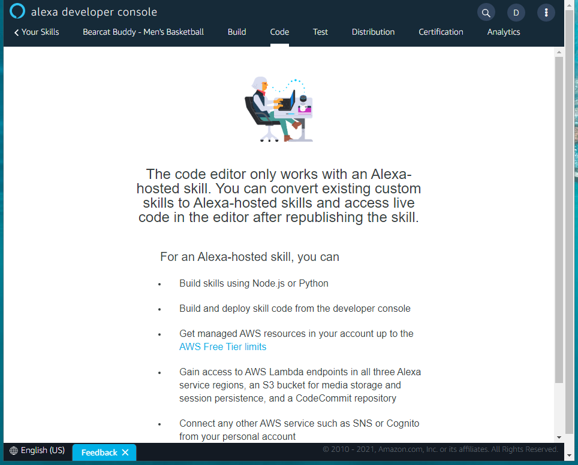

# Workshop 07 - Working through Alexa Code Tasks (30 minutes)

1. Design your (endpoint) code
2. Implement your code
3. Test your code

## Design (Endpoint Code)

Two files required:

1. index.js (already created)
2. games.json (create a new empty file)

One has our logic, one has the game data. Google to find the upcoming games for your favorite team.

## Implement (Endpoint Code)

### Code index.js

Modify the default code provided using the example.

1. Require the sdk (lines 1-4)
2. Configure your constants (6-15)
3. Require the games.json data file (17-18)
4. Copy the helper function to "get next" (20-47)
5. Copy the helper function to "get remaining" (49-78)

Verify the handlers.

1. LaunchRequestHandler (on start)
2. NextIntentHandler - the first of our custom Intent Handlers
3. RemainingIntentHandler - the second of our custom Intent Handlers
4. HelpIntentHandler
5. CancelAndStopIntentHandler
6. SessionEndedRequestHandler (on end)
7. IntentReflectorHandler - for debugging
8. ErrorHandler - pardon, I missed that

Remove any unnecessary handlers.

Customize the constructor.

```Node
// The SkillBuilder acts as the entry point for your skill, routing all request and response
// payloads to the handlers above. Make sure any new handlers or interceptors you've
// defined are included below. The order matters - they're processed top to bottom.
exports.handler = Alexa.SkillBuilders.custom()
    .addRequestHandlers(
        LaunchRequestHandler,
        NextIntentHandler,  //  add custom intents and remove any unnecessary ones (e.g. hello world)
        RemainingIntentHandler, //  add custom intents and remove any unnecessary ones (e.g. hello world)
        HelpIntentHandler,
        CancelAndStopIntentHandler,
        SessionEndedRequestHandler,
        IntentReflectorHandler, // make sure IntentReflectorHandler is last so it doesn't override your custom intent handlers
    )
    .addErrorHandlers(
        ErrorHandler,
    )
    .lambda();
```

### games.json

Add a new empty file, copy in the sample data. Customize the data with your schedule. Be careful with syntax.

## Test Your Code 

Go to code, make sure your current version has been saved (click "Save") and then deployed (click "Deploy"). 

Steps:

1. Go to Test tab.
2. Set "Skill testing is enabled in:" to Development.
3. Type or say "open bearcat buddy football".
4. Listen to response.
5. Type or say "When is the next game?"

## Debugging

Errors?  Go back to the "Code" tab - it will mark syntax errors with an "X" and warnings, too. 

Address any issues. Use the sample code for examples.

After fixing, click "Save", then "Deploy" to retest. 

---

[:arrow_backward: Back ](./workshop-06.md) • [ Next :arrow_forward:](./workshop-08.md)

---


