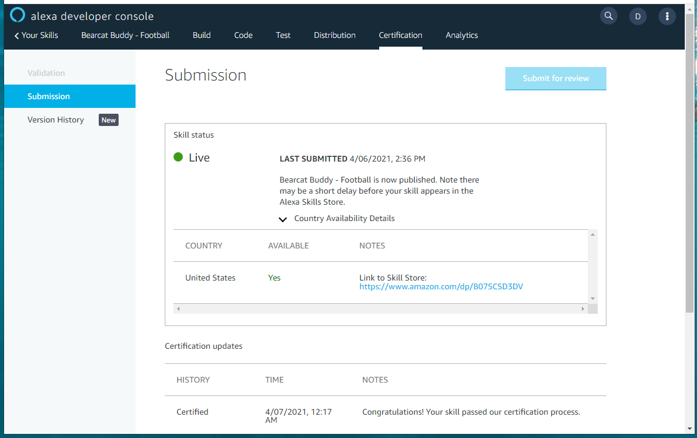

# Workshop 08 - Prepare and Certify (20 minutes)

1. Prepare Distribution Information
2. Certify your Skill
3. Find your Store URL

## Perpare Distribution information

Here's the distribution information for the example app.

1. Public Name: Bearcat Buddy Football (use your invokation)
2. One Sentance Description: Bearcat Buddy Football knows the upcoming sports schedule for NWMSU
3. Detailed Description: Say Alexa, open Bearcat Buddy Football. Then ask 'when is the next game' or 'how many games remaining?'
4. What's New: Updated for 2021 Football Season
5. Example phrases (Alexa, open Bearcat Buddy Football, When is the next game?, How many games remaining?)
7. Small skill icon (click to use the Alexa icon builder)
8. Large skill icon (click to use the Alexa icon builder)
9. Category: Education & Reference
10. Keywords: Northwest, Missouri, State, University, Bearcat, Football, Schedule
11. Privacy Policy URL (left blank)
12. Terms of Use URL (left blank)

Click "Save and Continue".

## Certify and publish your skill

Open the "Certification" tab and submit your skill for review. 
Typically results return within a day or so. 

## Find Your Store URL

After a successful review, the Certification tab shows your skill is "Live" with a green dot.

On the Certification tab, click "Country Availability Details".  
Get your link to the Sklil Store.

---

[:arrow_backward: Back ](./workshop-07.md) • [ Next :arrow_forward:](./workshop-09.md)

---

